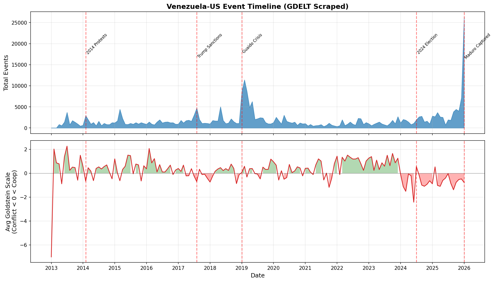
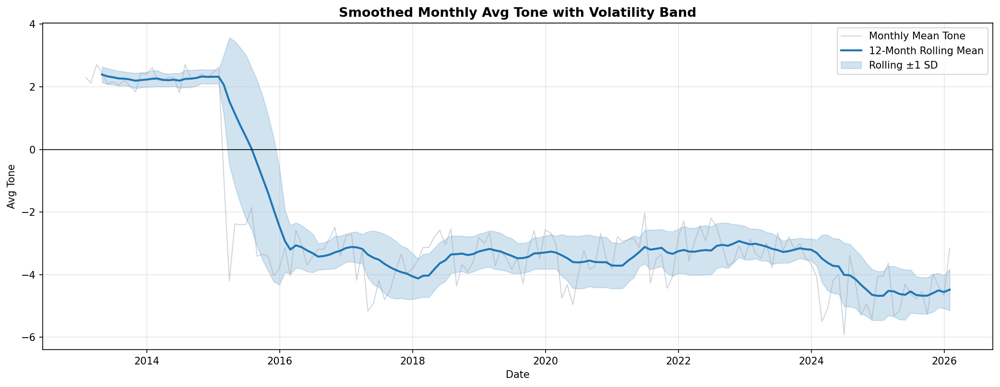
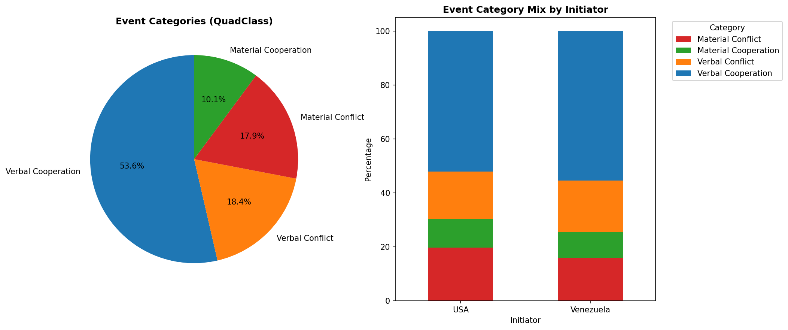
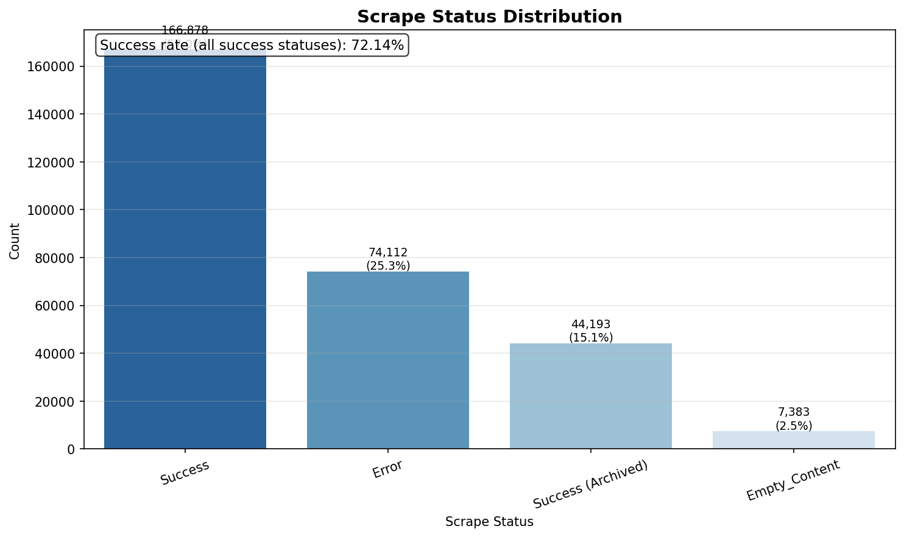
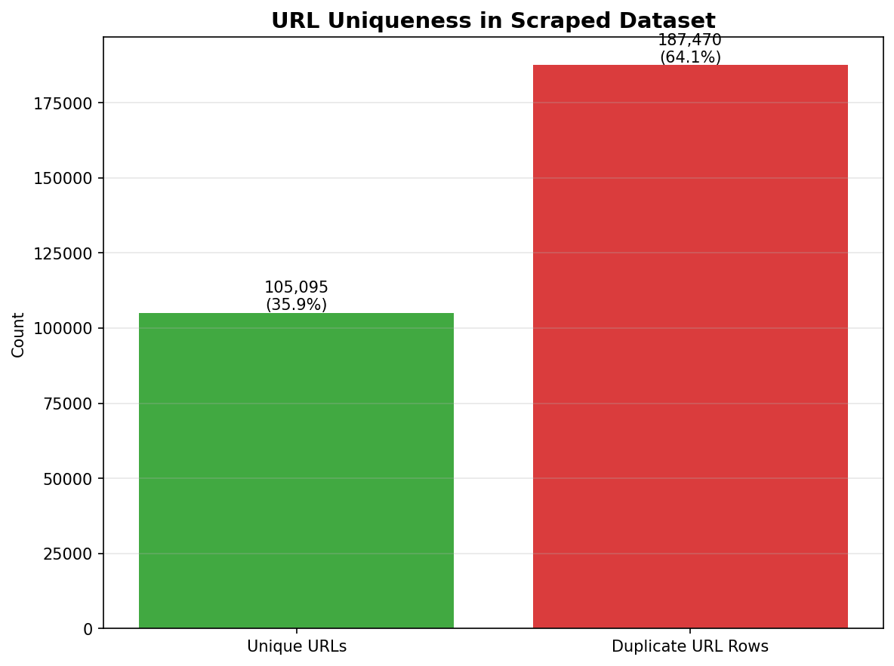
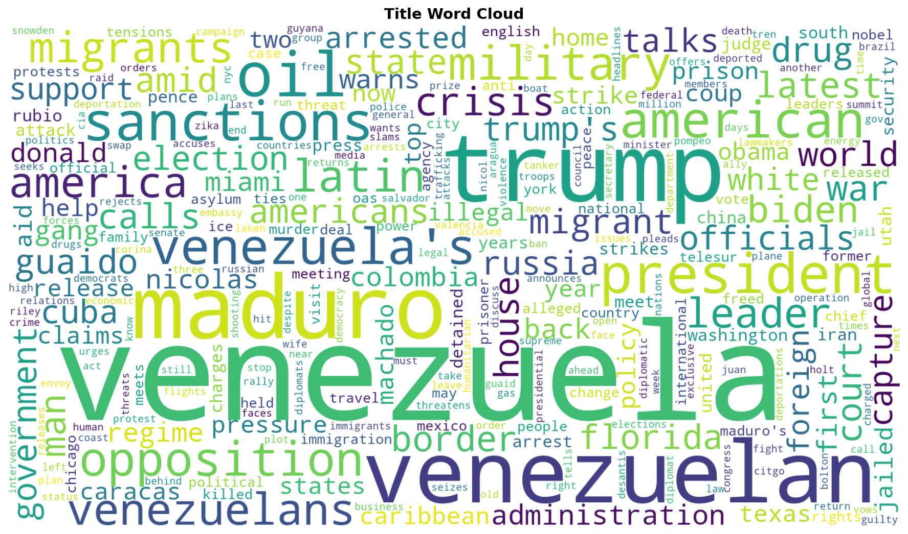

# Venezuela-US GDELT Comprehensive Scraped Analysis Report

## Overview

| Metric | Value |
|--------|-------|
| **Data Period** | 2013-01-07 ~ 2026-01-26 |
| **Total Events** | 292,566 |
| **Avg Goldstein Scale** | 0.04 |
| **Avg Tone** | -3.08 |
| **Median Tone** | -3.25 |
| **Initiator Split (VEN / USA)** | 136,614 / 155,952 |
| **Successful Scrapes** | 211,071 |
| **Scrape Success Rate** | 72.14% |
| **Unique URLs** | 105,095 |
| **Duplicate URL Rows** | 187,470 |

### Data Source
- **Dataset**: Scraped GDELT (Venezuela-US filtered interactions)
- **Scope**: Event metadata + scraped article title/text content

---

## Timeline Analysis

### Full Timeline (2013 - 2026)

### Key Insights
- **Volume**: Spikes in event volume correlate with major political milestones.
- **Stability**: Monthly Goldstein means moving below zero indicate more conflict-heavy periods.

### Top 10 Peak Activity Months

| Month | Events |
|-------|--------|
| 2026-01 | 26,252 |
| 2019-02 | 11,409 |
| 2019-03 | 8,700 |
| 2019-01 | 8,569 |
| 2025-12 | 7,191 |
| 2019-05 | 6,268 |
| 2018-05 | 5,045 |
| 2019-04 | 4,874 |
| 2017-08 | 4,721 |
| 2015-03 | 4,437 |

---

## Yearly Trends

### Summary
- **Activity**: Event volume by year captures macro-level intensity of interaction.
- **Tone Distribution**: Box plots show within-year dispersion and outliers in media tone.

### Smoothed Tone Trend

- **Rolling Mean**: Highlights medium-term direction shifts.
- **Volatility Band (±1 SD)**: Shows periods of high/low tone variability.

---

## Event Categories (QuadClass)

### Categories Defined
- **Verbal Cooperation**: Statements of support, negotiation, promises.
- **Material Cooperation**: Economic aid, agreements, visits.
- **Verbal Conflict**: Threats, demands, disapproval.
- **Material Conflict**: Sanctions, protests, military acts.

---

## Intensity & Sentiment

### Metric Distributions
- **Goldstein Scale**: Event impact on stability from conflict (-) to cooperation (+).
- **AvgTone**: Sentiment proxy of related coverage.

---

## Extreme Events

### Top Conflict Events (Lowest Goldstein)
| Date | Actor 1 | Actor 2 | Code | Goldstein | Title |
|------|---------|---------|------|-----------|-------|
| 2025-09-03 | VENEZUELA | THE WHITE HOUSE | 193 | -10.0 | U.S. military strike kills 11 people on alleged Venezuelan drug boat |
| 2013-12-24 | VENEZUELA | A US | 190 | -10.0 | Not found |
| 2013-12-24 | VENEZUELA | UNITED STATES | 193 | -10.0 | 13 stories unforgettable personal essays in parenting, relationships |
| 2023-05-16 | UNITED STATES | VENEZUELAN | 190 | -10.0 | Tragedy in Texas as Pandemic Border Policy Ends — and a Rush to Judgment |
| 2026-01-05 | NEW YORK | VENEZUELA | 190 | -10.0 | Cuba: 32 citizens killed in US operation in Venezuela |

### Top Cooperation Events (Highest Goldstein)
| Date | Actor 1 | Actor 2 | Code | Goldstein | Title |
|------|---------|---------|------|-----------|-------|
| 2025-11-07 | UNITED STATES | VENEZUELA | 874 | 10.0 | Senate GOP Blocks War Powers Resolution on U.S. Venezuela Strikes |
| 2023-06-01 | ANGEL FALLS | UNITED STATES | 874 | 10.0 | Have You Done the Maine Waterfall Loop That Takes You to 8 Waterfalls? |
| 2019-02-12 | VENEZUELA | UNITED STATES | 874 | 10.0 | Not found |
| 2014-02-01 | VENEZUELAN | AMERICAN | 874 | 10.0 | Latest Human Rights Watch Report: 30 Lies About Venezuela |
| 2023-10-19 | VENEZUELA | CHICAGO | 874 | 10.0 | Your Illinois News Radar » *** UPDATED x2 *** Mayor Johnson condemns ‘physical attack’ on alderperso... |

---

## Scrape Quality

### Scrape Status Breakdown

| Status | Count |
|--------|-------|
| Success | 166,878 |
| Error | 74,112 |
| Success (Archived) | 44,193 |
| Empty_Content | 7,383 |

### URL Uniqueness

---

## Content Analysis: Title

### Top Title Terms

| Word | Frequency | Share |
|------|-----------|-------|
| venezuela | 78,050 | 5.14% |
| trump | 31,501 | 2.08% |
| maduro | 26,472 | 1.74% |
| venezuelan | 25,498 | 1.68% |
| oil | 11,349 | 0.75% |
| president | 8,814 | 0.58% |
| sanctions | 8,470 | 0.56% |
| american | 7,466 | 0.49% |
| venezuela's | 7,161 | 0.47% |
| opposition | 6,500 | 0.43% |

## Content Analysis: Text

### Top Text Terms

| Word | Frequency | Share |
|------|-----------|-------|
| venezuela | 1,008,259 | 1.23% |
| maduro | 686,337 | 0.84% |
| president | 619,814 | 0.76% |
| trump | 587,429 | 0.72% |
| venezuelan | 530,122 | 0.65% |
| government | 408,765 | 0.50% |
| states | 364,656 | 0.44% |
| united | 353,985 | 0.43% |
| country | 328,816 | 0.40% |
| people | 327,782 | 0.40% |

---

*Generated: 2026-02-18*
