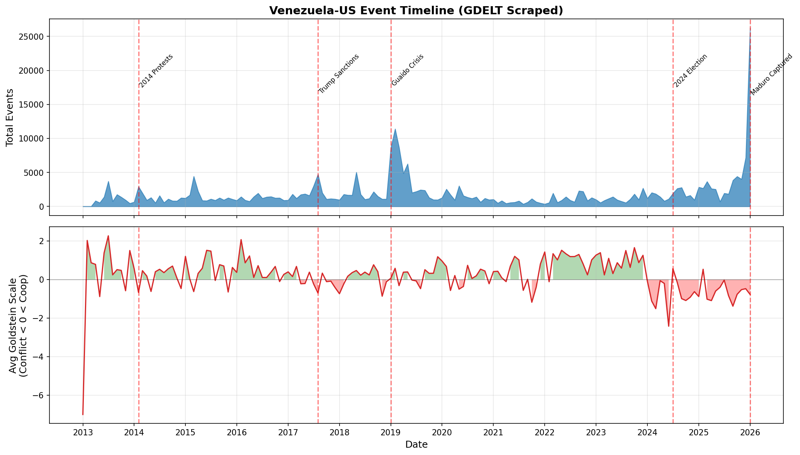
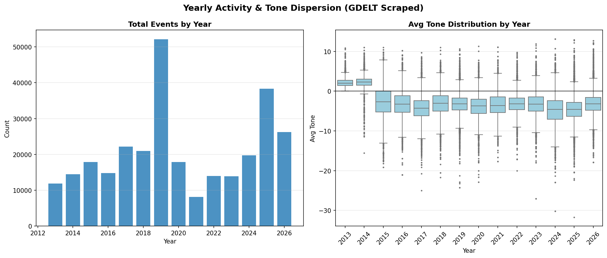
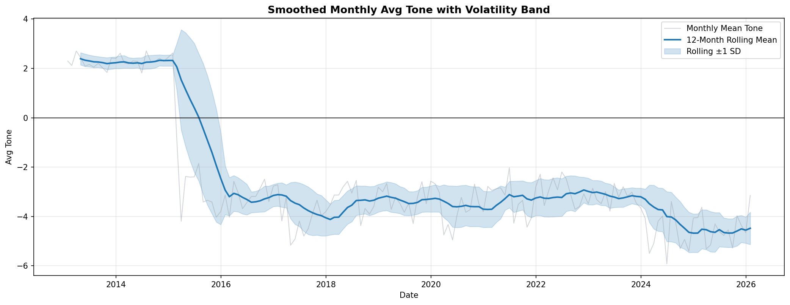
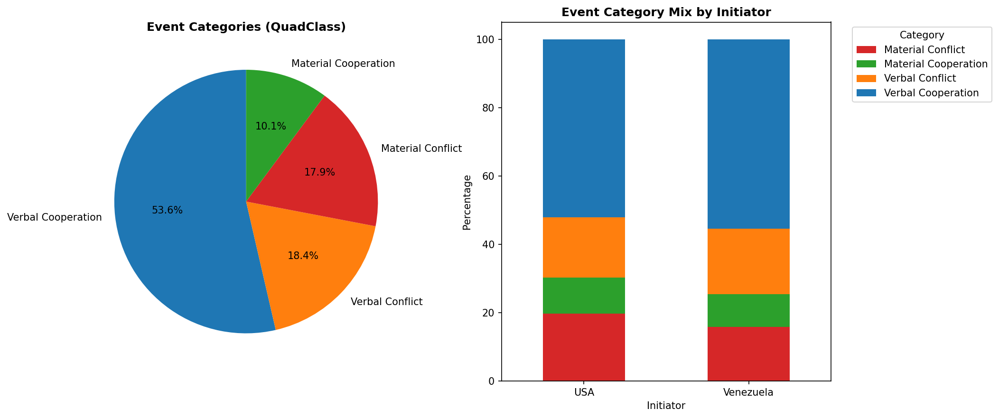
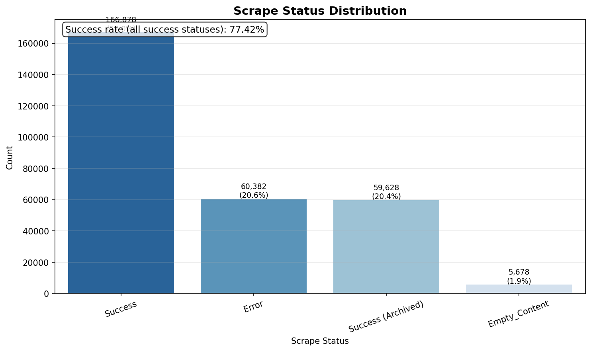
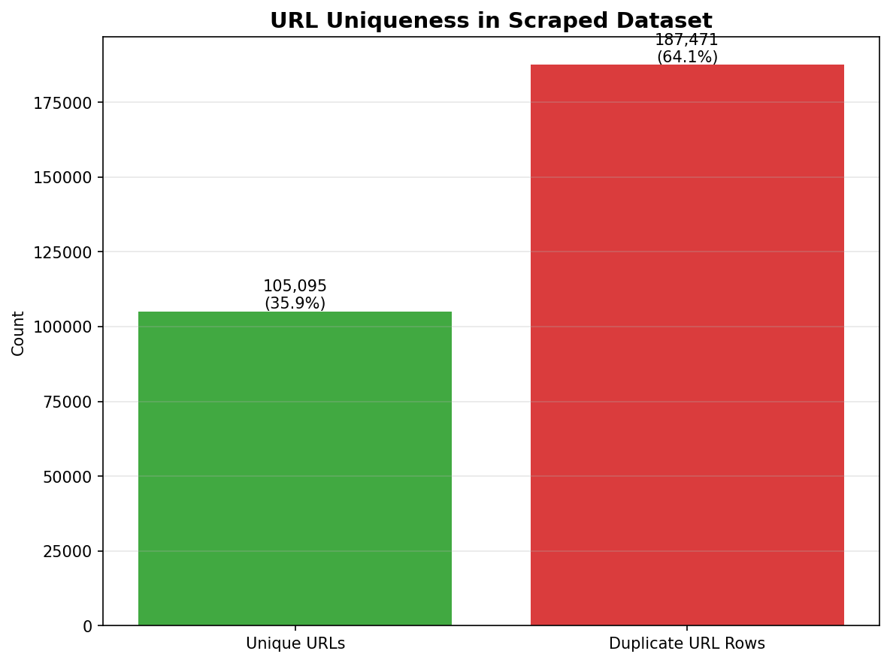
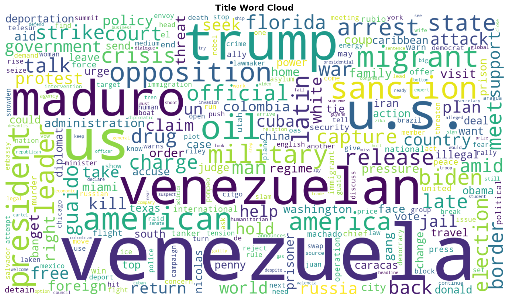
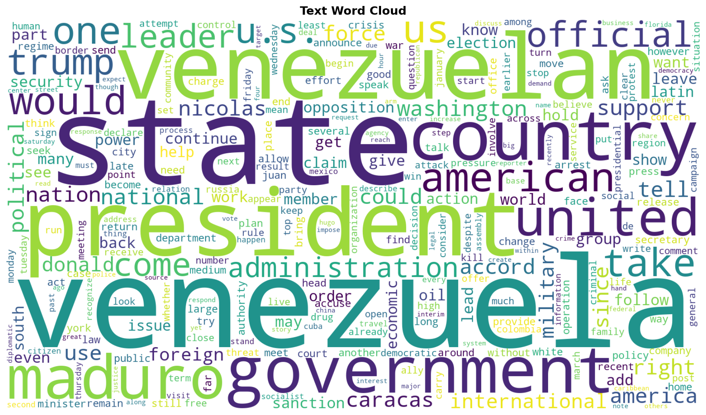

# Venezuela-US GDELT Comprehensive Analysis Report

## Overview

| Metric | Value |
|--------|-------|
| **Data Period** | 2013-01-07 ~ 2026-01-26 |
| **Total Events** | 292,566 |
| **Avg Goldstein Scale** | 0.04 |
| **Avg Tone** | -3.08 |
| **Median Tone** | -3.25 |
| **Initiator Split (VEN / USA)** | 136,614 / 155,952 |
| **Successful Scrapes** | 226,506 |
| **Scrape Success Rate** | 77.42% |
| **Unique URLs** | 105,095 |
| **Duplicate URL Rows** | 187,471 |

### Data Source
- **Dataset**: Analysis-ready GDELT parquet join (Venezuela-US filtered interactions)
- **Scope**: Event metadata from `analysis_events.parquet` + scraped article title/text content from `analysis_url_content.parquet`

---

## Timeline Analysis

### Full Timeline (2013 - 2026)

### Key Insights
- **Volume**: Spikes in event volume correlate with major political milestones.
- **Stability**: Monthly Goldstein means moving below zero indicate more conflict-heavy periods.

### Top 10 Peak Activity Months

| Month | Events |
|-------|--------|
| 2026-01 | 26,252 |
| 2019-02 | 11,409 |
| 2019-03 | 8,700 |
| 2019-01 | 8,569 |
| 2025-12 | 7,191 |
| 2019-05 | 6,268 |
| 2018-05 | 5,045 |
| 2019-04 | 4,874 |
| 2017-08 | 4,721 |
| 2015-03 | 4,437 |

---

## Yearly Trends

### Summary
- **Activity**: Event volume by year captures macro-level intensity of interaction.
- **Tone Distribution**: Box plots show within-year dispersion and outliers in media tone.

### Smoothed Tone Trend

- **Rolling Mean**: Highlights medium-term direction shifts.
- **Volatility Band (±1 SD)**: Shows periods of high/low tone variability.

---

## Event Categories (QuadClass)

### Categories Defined
- **Verbal Cooperation**: Statements of support, negotiation, promises.
- **Material Cooperation**: Economic aid, agreements, visits.
- **Verbal Conflict**: Threats, demands, disapproval.
- **Material Conflict**: Sanctions, protests, military acts.

---

## Intensity & Sentiment

### Metric Distributions
- **Goldstein Scale**: Event impact on stability from conflict (-) to cooperation (+).
- **AvgTone**: Sentiment proxy of related coverage.

---

## Extreme Events

### Top Conflict Events (Lowest Goldstein)
| Date | Actor 1 | Actor 2 | Code | Goldstein | Title |
|------|---------|---------|------|-----------|-------|
| 2013-12-24 | VENEZUELA | UNITED STATES | 193 | -10.0 | 13 stories unforgettable personal essays in parenting, relationships |
| 2020-08-20 | VENEZUELAN | SAN FRANCISCO | 190 | -10.0 | Crime spikes as Soros-funded DAs take charge: 'They're not progressive, they're rogue' |
| 2015-03-03 | VENEZUELA | REUTERS | 193 | -10.0 | Venezuela to charge 8 police in young men's disappearance, death |
| 2019-04-02 | VENEZUELA | UNITED STATES | 190 | -10.0 | The Latest: Venezuela judge seeks to strip Guaido's immunity |
| 2026-01-04 | UNITED STATES | VENEZUELA | 193 | -10.0 | ‘We’re going to run it’: Trump says military to stay in Venezuela for now |

### Top Cooperation Events (Highest Goldstein)
| Date | Actor 1 | Actor 2 | Code | Goldstein | Title |
|------|---------|---------|------|-----------|-------|
| 2024-04-03 | VENEZUELA | AMERICAN | 874 | 10.0 | Wife's brutal punishment for deported migrant influencer who showed illegals how to squat in US home... |
| 2025-04-07 | VENEZUELA | UNITED STATES | 874 | 10.0 | The frenzied 24 hours when Venezuelan migrants in the US were shipped to an El Salvador prison |
| 2026-01-10 | THE US | VENEZUELA | 874 | 10.0 | Rodriguez or Trump: Who Is Really Running Venezuela? |
| 2018-05-16 | VENEZUELAN | KELLOGG COMPANY | 874 | 10.0 | The Sprout: NAFTA clock ticking and big dog lickings |
| 2026-01-12 | UNITED STATES | VENEZUELA | 874 | 10.0 | Trump goes rogue against Venezuela and lays out his imperialistic goals |

---

## Scrape Quality

### Scrape Status Breakdown

| Status | Count |
|--------|-------|
| Success | 166,878 |
| Error | 60,382 |
| Success (Archived) | 59,628 |
| Empty_Content | 5,678 |

### URL Uniqueness

---

## Content Analysis: Title

### Top Title Terms

| Word | Frequency | Share |
|------|-----------|-------|
| venezuela | 102,204 | 5.61% |
| us | 47,314 | 2.60% |
| trump | 38,767 | 2.13% |
| u.s. | 37,324 | 2.05% |
| venezuelan | 36,918 | 2.03% |
| maduro | 33,522 | 1.84% |
| oil | 13,694 | 0.75% |
| american | 11,532 | 0.63% |
| sanction | 11,319 | 0.62% |
| president | 10,775 | 0.59% |

## Content Analysis: Text

### Top Text Terms

| Word | Frequency | Share |
|------|-----------|-------|
| venezuela | 194,588 | 0.35% |
| state | 185,355 | 0.33% |
| president | 180,631 | 0.33% |
| venezuelan | 173,984 | 0.31% |
| country | 167,674 | 0.30% |
| government | 145,668 | 0.26% |
| maduro | 144,143 | 0.26% |
| united | 141,301 | 0.25% |
| american | 137,901 | 0.25% |
| would | 127,229 | 0.23% |

---

*Generated: 2026-03-18*
