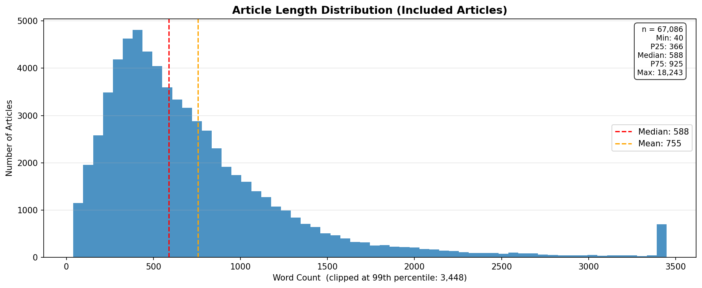
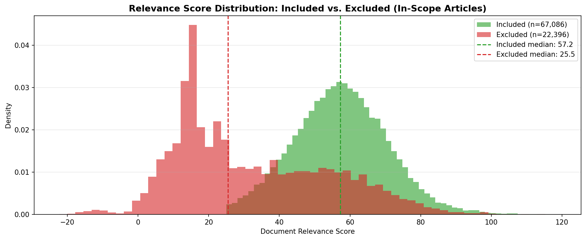
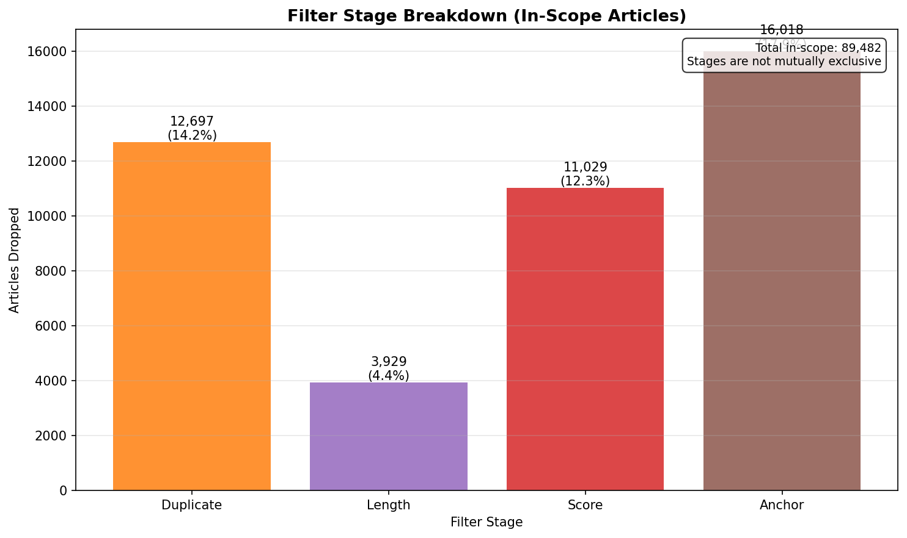
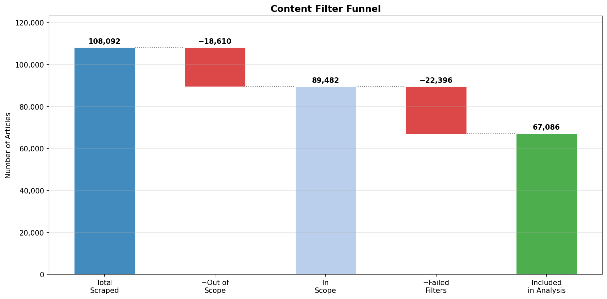

# Venezuela-US GDELT Comprehensive Analysis Report

## Overview

| Metric | Value |
|--------|-------|
| **Data Period** | 2013-01-07 ~ 2026-03-27 |
| **Total Events** | 301,459 |
| **Avg Goldstein Scale** | 0.02 |
| **Avg Tone** | -3.08 |
| **Median Tone** | -3.24 |
| **Initiator Split (VEN / USA)** | 140,465 / 160,994 |
| **Unique URLs** | 108,224 |
| **Articles in Analysis Corpus** | 67,086 |

### Data Source
- **Dataset**: Analysis-ready GDELT parquet join (Venezuela-US filtered interactions)
- **Scope**: Event metadata from `analysis_events.parquet` + scraped article title/text content from `analysis_url_content.parquet`

---

## Content Analysis

### Title Word Cloud

### Top Title Terms

| Word | Frequency | Share |
|------|-----------|-------|
| venezuela | 34,723 | 5.50% |
| us | 16,438 | 2.61% |
| trump | 13,758 | 2.18% |
| u.s. | 12,665 | 2.01% |
| venezuelan | 11,917 | 1.89% |
| maduro | 10,920 | 1.73% |
| oil | 5,611 | 0.89% |
| sanction | 4,037 | 0.64% |
| president | 3,758 | 0.60% |
| american | 3,350 | 0.53% |

### Text Word Cloud

### Top Text Terms

| Word | Frequency | Share |
|------|-----------|-------|
| venezuela | 67,309 | 0.38% |
| state | 63,614 | 0.36% |
| president | 62,179 | 0.35% |
| venezuelan | 58,464 | 0.33% |
| country | 57,693 | 0.32% |
| government | 49,453 | 0.28% |
| maduro | 48,463 | 0.27% |
| united | 47,336 | 0.26% |
| american | 45,887 | 0.26% |
| us | 43,752 | 0.24% |

---

## Timeline Analysis

### Full Timeline (2013 - 2026)

### Key Insights
- **Volume**: Spikes in event volume correlate with major political milestones.
- **Stability**: Monthly Goldstein means moving below zero indicate more conflict-heavy periods.

### Top 10 Peak Activity Months

| Month | Events |
|-------|--------|
| 2026-01 | 27,925 |
| 2019-02 | 11,409 |
| 2019-03 | 8,700 |
| 2019-01 | 8,569 |
| 2025-12 | 7,191 |
| 2019-05 | 6,268 |
| 2018-05 | 5,045 |
| 2019-04 | 4,874 |
| 2017-08 | 4,721 |
| 2015-03 | 4,437 |

---

## Yearly Trends

### Summary
- **Activity**: Event volume by year captures macro-level intensity of interaction.
- **Tone Distribution**: Box plots show within-year dispersion and outliers in media tone.

### Smoothed Tone Trend

- **Rolling Mean**: Highlights medium-term direction shifts.
- **Volatility Band (±1 SD)**: Shows periods of high/low tone variability.

---

## Event Categories (QuadClass)

### Categories Defined
- **Verbal Cooperation**: Statements of support, negotiation, promises.
- **Material Cooperation**: Economic aid, agreements, visits.
- **Verbal Conflict**: Threats, demands, disapproval.
- **Material Conflict**: Sanctions, protests, military acts.

---

## Intensity & Sentiment

### Metric Distributions
- **Goldstein Scale**: Event impact on stability from conflict (-) to cooperation (+).
- **AvgTone**: Sentiment proxy of related coverage.

---

## Extreme Events

### Top Conflict Events (Lowest Goldstein)
| Date | Actor 1 | Actor 2 | Code | Goldstein | Title |
|------|---------|---------|------|-----------|-------|
| 2023-01-26 | VENEZUELA | UNITED STATES | 190 | -10.0 | Venezuelan diplomat convicted of 2012 murder of Amb. Olga Fonseca |
| 2021-10-26 | UNITED STATES | VENEZUELA | 190 | -10.0 | Illinois Mayor Hires A Formerly Incarcerated Child Sex Offender To Inspect Community Homes And Resid... |
| 2021-09-24 | VENEZUELA | UNITED STATES | 190 | -10.0 | CNSNews |
| 2026-01-22 | UNITED STATES | VENEZUELA | 190 | -10.0 | The Board of Discord |
| 2024-03-09 | VENEZUELA | UNITED STATES | 190 | -10.0 | Greg Gutfeld Praises Joe Biden for Not Saying ‘Undocumented’: ‘Feeble, but at Least He Said ‘Illegal... |

### Top Cooperation Events (Highest Goldstein)
| Date | Actor 1 | Actor 2 | Code | Goldstein | Title |
|------|---------|---------|------|-----------|-------|
| 2017-06-06 | VENEZUELA | CHICAGO | 874 | 10.0 | United Continental : to axe Venezuela flights from early 3Q17 |
| 2017-12-31 | VENEZUELAN | AMERICAN | 874 | 10.0 | Events that left their mark on 2017 (PART 2) |
| 2016-12-09 | CALIFORNIA | VENEZUELA | 874 | 10.0 | This Los Angeles–Based Creative Director Is Bringing Boho Vibes to Her Venezuelan Holiday Traditions |
| 2015-11-06 | VENEZUELA | AMERICAN | 874 | 10.0 | Venezuela Officially Withdraws from Human Rights Body |
| 2025-11-07 | UNITED STATES | VENEZUELA | 874 | 10.0 | Senate GOP Blocks War Powers Resolution on U.S. Venezuela Strikes |

---

## Appendix: Data Quality & Methodology

### Scrape Quality

#### Scrape Status Breakdown

| Status | Count |
|--------|-------|
| Success | 174,080 |
| Error | 61,494 |
| Success (Archived) | 59,628 |
| Empty_Content | 6,257 |

| **Successful Scrapes** | 233,708 |
| **Scrape Success Rate** | 77.53% |
| **Duplicate URL Rows** | 193,235 |

#### URL Uniqueness

---

### Article Length Distribution

#### Statistics (Included Articles)

| Metric | Value |
|--------|-------|
| **Count** | 67,086 |
| **Min** | 40 words |
| **25th Percentile** | 366 words |
| **Median** | 588 words |
| **Mean** | 755 words |
| **75th Percentile** | 925 words |
| **99th Percentile** | 3,448 words |
| **Max** | 18,243 words |

---

### Relevance Score Distribution

#### Statistics by Inclusion Status (In-Scope Articles)

| Metric | Included | Excluded |
|--------|----------|----------|
| **Count** | 67,086 | 22,396 |
| **Min** | 25.0 | -22.4 |
| **Median** | 57.2 | 25.5 |
| **Mean** | 57.4 | 32.1 |
| **Max** | 118.4 | 115.2 |

---

### Filter Stage Breakdown

#### Drop Count by Stage (In-Scope Articles, Stages Not Mutually Exclusive)

| Stage | Dropped | % of In-Scope |
|-------|---------|---------------|
| **Duplicate** | 12,697 | 14.2% |
| **Length** | 3,929 | 4.4% |
| **Score** | 11,029 | 12.3% |
| **Anchor** | 16,018 | 17.9% |

---

### Content Filter Funnel

#### Funnel Steps

| Step | Articles | Removed |
|------|----------|---------|
| **Total Scraped** | 108,092 | — |
| **After Scope Filter** | 89,482 | 18,610 out of scope |
| **After Content Filters** | 67,086 | 22,396 failed filters |

---

*Generated: 2026-03-27*
