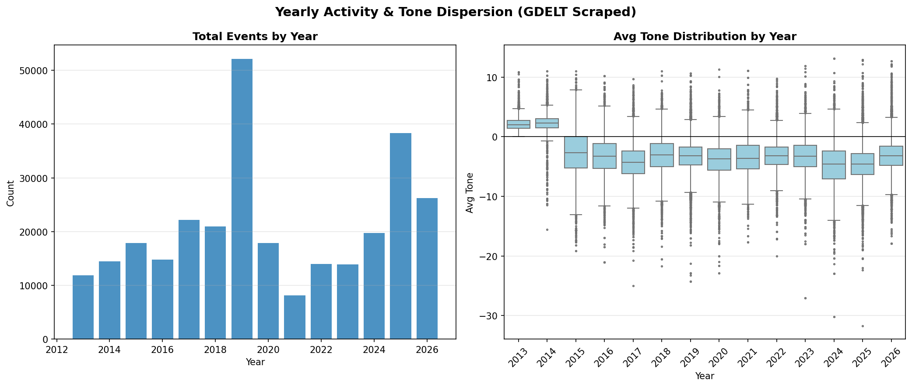
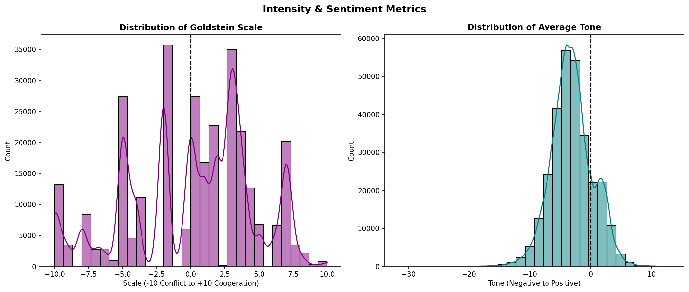
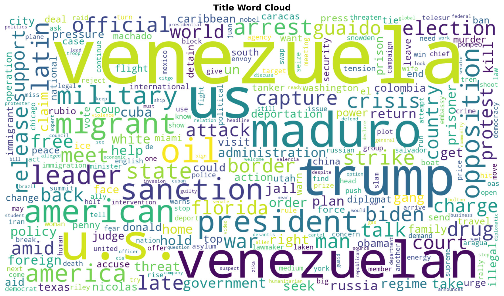
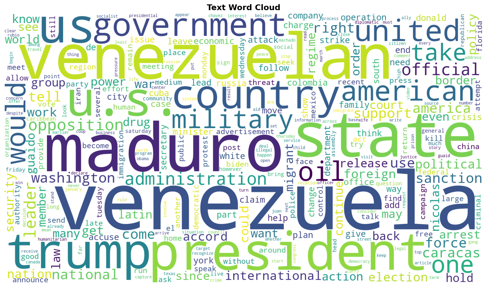

# Venezuela-US GDELT Comprehensive Scraped Analysis Report

## Overview

| Metric | Value |
|--------|-------|
| **Data Period** | 2013-01-07 ~ 2026-01-26 |
| **Total Events** | 292,566 |
| **Avg Goldstein Scale** | 0.04 |
| **Avg Tone** | -3.08 |
| **Median Tone** | -3.25 |
| **Initiator Split (VEN / USA)** | 136,614 / 155,952 |
| **Successful Scrapes** | 211,071 |
| **Scrape Success Rate** | 72.14% |
| **Unique URLs** | 105,095 |
| **Duplicate URL Rows** | 187,470 |

### Data Source
- **Dataset**: Scraped GDELT (Venezuela-US filtered interactions)
- **Scope**: Event metadata + scraped article title/text content

---

## Timeline Analysis

### Full Timeline (2013 - 2026)

### Key Insights
- **Volume**: Spikes in event volume correlate with major political milestones.
- **Stability**: Monthly Goldstein means moving below zero indicate more conflict-heavy periods.

### Top 10 Peak Activity Months

| Month | Events |
|-------|--------|
| 2026-01 | 26,252 |
| 2019-02 | 11,409 |
| 2019-03 | 8,700 |
| 2019-01 | 8,569 |
| 2025-12 | 7,191 |
| 2019-05 | 6,268 |
| 2018-05 | 5,045 |
| 2019-04 | 4,874 |
| 2017-08 | 4,721 |
| 2015-03 | 4,437 |

---

## Yearly Trends

### Summary
- **Activity**: Event volume by year captures macro-level intensity of interaction.
- **Tone Distribution**: Box plots show within-year dispersion and outliers in media tone.

### Smoothed Tone Trend

- **Rolling Mean**: Highlights medium-term direction shifts.
- **Volatility Band (±1 SD)**: Shows periods of high/low tone variability.

---

## Event Categories (QuadClass)

### Categories Defined
- **Verbal Cooperation**: Statements of support, negotiation, promises.
- **Material Cooperation**: Economic aid, agreements, visits.
- **Verbal Conflict**: Threats, demands, disapproval.
- **Material Conflict**: Sanctions, protests, military acts.

---

## Intensity & Sentiment

### Metric Distributions
- **Goldstein Scale**: Event impact on stability from conflict (-) to cooperation (+).
- **AvgTone**: Sentiment proxy of related coverage.

---

## Extreme Events

### Top Conflict Events (Lowest Goldstein)
| Date | Actor 1 | Actor 2 | Code | Goldstein | Title |
|------|---------|---------|------|-----------|-------|
| 2026-01-11 | PORTLAND | VENEZUELAN | 193 | -10.0 | Anti-ICE protest comes to Nebraska after shootings in Minnesota, Oregon |
| 2026-01-25 | VENEZUELAN | AMERICAN | 195 | -10.0 | Exclusive-Mexico weighs stopping oil shipments to Cuba amid concerns of Trump retaliation, sources s... |
| 2013-12-29 | SAN ANTONIO | VENEZUELA | 195 | -10.0 | The NSA Uses Powerful Toolbox in Effort to Spy on Global Networks |
| 2013-12-29 | SAN ANTONIO | VENEZUELA | 195 | -10.0 | The NSA Uses Powerful Toolbox in Effort to Spy on Global Networks |
| 2025-09-15 | AMERICAN | VENEZUELA | 193 | -10.0 | Trump wont rule out striking Venezuela |

### Top Cooperation Events (Highest Goldstein)
| Date | Actor 1 | Actor 2 | Code | Goldstein | Title |
|------|---------|---------|------|-----------|-------|
| 2018-12-11 | SAN ANTONIO | VENEZUELA | 874 | 10.0 | ‘Amazing Race’ star details dramatic escape from Venezuela |
| 2013-07-24 | VENEZUELAN | MIAMI | 874 | 10.0 | Venezuela Consulate Empty But Paying |
| 2025-03-18 | UNITED STATES | VENEZUELA | 874 | 10.0 | Factbox-Flight data shows timeline of the Venezuelan deportation operation |
| 2019-05-28 | VENEZUELA | UNITED STATES | 874 | 10.0 | EU names special adviser to help resolve Venezuela crisis |
| 2017-04-28 | VENEZUELA | UNITED STATES | 874 | 10.0 | Client Challenge |

---

## Scrape Quality

### Scrape Status Breakdown

| Status | Count |
|--------|-------|
| Success | 166,878 |
| Error | 74,112 |
| Success (Archived) | 44,193 |
| Empty_Content | 7,383 |

### URL Uniqueness

---

## Content Analysis: Title

### Top Title Terms

| Word | Frequency | Share |
|------|-----------|-------|
| venezuela | 83,616 | 5.49% |
| us | 38,693 | 2.54% |
| trump | 33,880 | 2.22% |
| u.s. | 30,796 | 2.02% |
| venezuelan | 30,729 | 2.02% |
| maduro | 27,473 | 1.80% |
| oil | 11,136 | 0.73% |
| american | 9,993 | 0.66% |
| president | 9,055 | 0.59% |
| sanction | 8,863 | 0.58% |

## Content Analysis: Text

### Top Text Terms

| Word | Frequency | Share |
|------|-----------|-------|
| venezuela | 1,081,668 | 1.40% |
| maduro | 722,962 | 0.93% |
| venezuelan | 637,143 | 0.82% |
| state | 627,928 | 0.81% |
| president | 622,426 | 0.80% |
| trump | 615,028 | 0.79% |
| us | 594,045 | 0.77% |
| u.s. | 589,801 | 0.76% |
| country | 505,015 | 0.65% |
| government | 426,847 | 0.55% |

---

*Generated: 2026-03-11*
