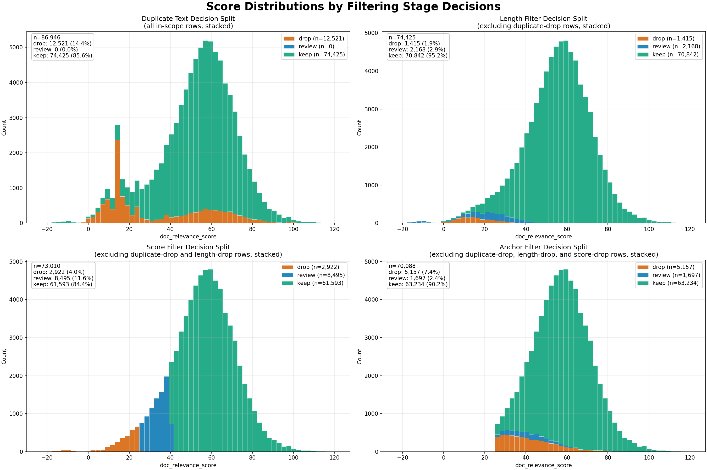

# Preprocessing Pipeline

This folder contains the full preprocessing workflow for `data/gdelt_scraped.csv`.

The orchestrator is:

`run_preprocessing_pipeline.py`

It runs **7 scripts in fixed order**. The goal is to transform scraped URL text into:

- URL-level lookup features (`url_lookup*.csv`)
- token relevance weights (`text_relevance_tokens*.csv`)
- row-level filtering decisions (`url_filter_eval*.csv`)
- QA summaries/samples/plots for filter decisions

## Run

From `venezuela-us-gdelt-discourse/preprocessing`:

```powershell
python .\run_preprocessing_pipeline.py ..\data\gdelt_scraped.csv --force-retokenize --require-success-status
```

Optional: pass an explicit inclusion-rule config.

```powershell
python .\run_preprocessing_pipeline.py ..\data\gdelt_scraped.csv --filter-rules .\filter_rule_config.json
```

## Exactly What The Orchestrator Does (7 Steps)

When you run the orchestrator, you should see these headings in the console:

### Step 1/7: Build URL Index

Script: `build_url_index.py`

What it does:
- Canonicalizes `SourceURL`.
- Assigns stable `url_id` values.
- Reuses existing IDs from `url_lookup.csv` when URL canonical forms already exist.
- Assigns new IDs only for unseen canonical URLs.
- Upserts `url_lookup.csv` (one row per canonical URL, with representative `Title`/`Text`/status).

### Step 2/7: Tokenize URL Lookup

Script: `tokenize_url_lookup.py`

What it does:
- Tokenizes `Text` in `url_lookup.csv` and writes JSON token arrays into `Tokens`.
- Default behavior is incremental (tokenize rows missing tokens only).
- `--force-retokenize` retokenizes all non-empty text rows.

### Step 3/7: Build Duplicate Filter Eval (Early)

Script: `build_duplicate_filter_eval.py`

What it does:
- Builds early duplicate-text diagnostics from in-scope rows.
- Writes/updates `url_filter_eval*.csv` with duplicate hash, cluster size, and duplicate decision.
- Writes duplicate-oriented summary counts to `url_filter_summary_counts*.csv`.

### Step 4/7: Build Token Relevance Scores

Script: `build_text_relevance_tokens.py`

What it does:
- Uses tokenized documents to compute relevance scores per token.
- Uses duplicate-filter information from Step 3 (`--exclude-duplicate-drops` in orchestrator).
- `--require-success-status` restricts scoring input to success-status rows.
- Writes `text_relevance_tokens*.csv`.

### Step 5/7: Score URL Relevance

Script: `score_url_relevance.py`

What it does:
- Applies token relevance scores to each URL row in `url_lookup.csv`.
- Adds document-level scoring columns such as:
  - `doc_relevance_score`
  - `doc_relevance_sum`
  - `doc_relevance_matches`
  - `doc_token_count`

### Step 6/7: Evaluate Filter Strategy (Full)

Script: `evaluate_filter_strategy.py`

What it does:
- Recomputes the full filter strategy across in-scope rows:
  - duplicate decision
  - length decision
  - score decision
  - anchor decision
  - final decision + reasons
- Applies scope and threshold policy from `filter_rule_config.json`.
- Writes/updates `url_filter_eval*.csv` by `url_id` (existing IDs are updated with newly computed values).
- Rewrites `url_filter_summary_counts*.csv`.
- Writes stratified QA samples into `filter_samples*/`.

### Step 7/7: Plot Filter Stage Histograms

Script: `plot_filter_stage_score_histograms.py`

What it does:
- Reads `url_filter_eval*.csv`.
- Generates score histograms split by stage decisions.
- Writes `filter_stage_score_histograms*.png`.

## Output Files

- `url_lookup*.csv`: one row per canonical URL with scrape and scoring fields.
- `text_relevance_tokens*.csv`: token relevance table.
- `url_filter_eval*.csv`: row-level filter decisions and reason labels.
- `url_filter_summary_counts*.csv`: aggregate decision counts by stage.
- `filter_samples*/`: QA sample CSVs by stage/final decision.
- `filter_stage_score_histograms*.png`: visualization of score distributions by decision.

## Analysis-Ready Export

Standalone export script:

`build_analysis_ready_datasets.py`

It creates two parquet files:

- `analysis_events.parquet`: one row per original `gdelt_scraped.csv` event row, with `url_id` plus joined filter/scoring metadata.
- `analysis_url_content.parquet`: one row per `url_id`, with representative `Title`, `Text`, parsed `Tokens`, and filter/scoring metadata.

Default output directory:

`data/analysis_ready/`

Example:

```powershell
python .\build_analysis_ready_datasets.py --filter-rules .\filter_rule_config.json
```

Notes:

- The event table preserves the row count of `gdelt_scraped.csv`.
- By default, raw `Title` and `Text` are omitted from the event table to save space.
- `filter_final_decision` is preserved as the raw pipeline output.
- `filter_final_decision_effective` and `analysis_include` apply the current `review_handling` policy from `filter_rule_config.json`.
- With the current config, `review` is treated as `keep` for analysis exports while still being flagged via `analysis_review_flag`.

## Naming Behavior

- If input is the default `..\data\gdelt_scraped.csv`, outputs use base names:
  - `url_lookup.csv`, `text_relevance_tokens.csv`, `url_filter_eval.csv`, etc.
- If input is a different file, outputs get a suffix from the input filename stem:
  - for example `url_lookup_my_input.csv`, `url_filter_eval_my_input.csv`, etc.

## Notes

- The pipeline is intended to be rerun as `gdelt_scraped.csv` grows.
- URL-ID assignment is stable and incremental.
- The input scraped CSV is not overwritten by default; preprocessing artifacts are written in this folder unless explicit output flags are provided.

## Stage Histogram Example

Default figure:

`filter_stage_score_histograms.png`


