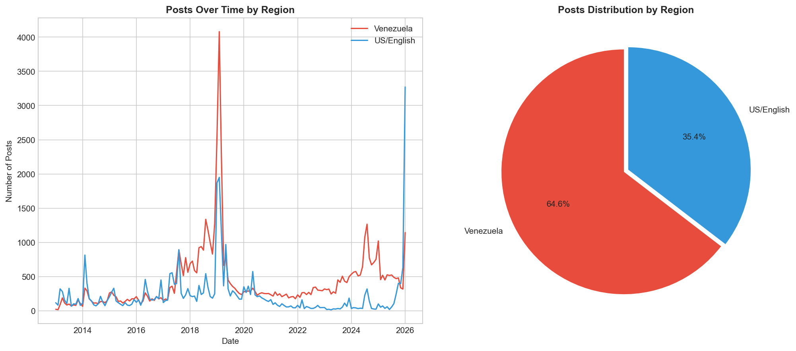
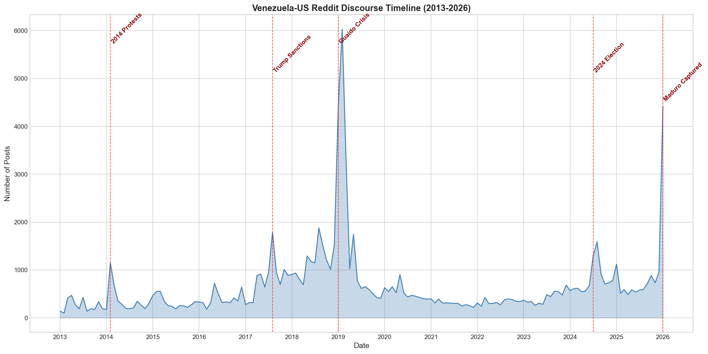
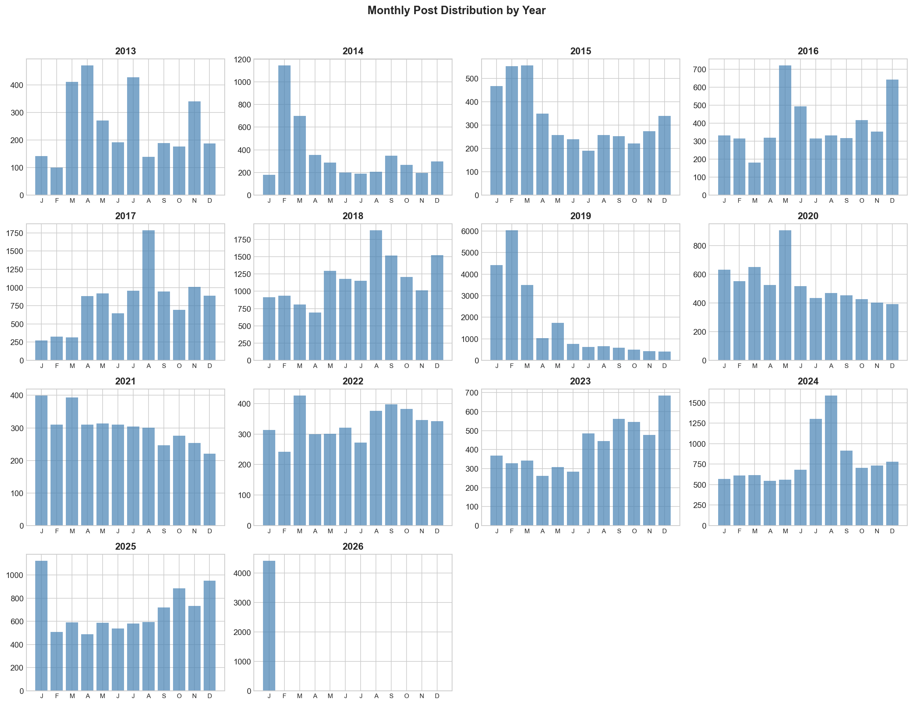
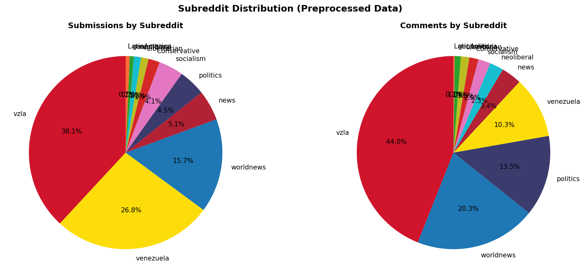
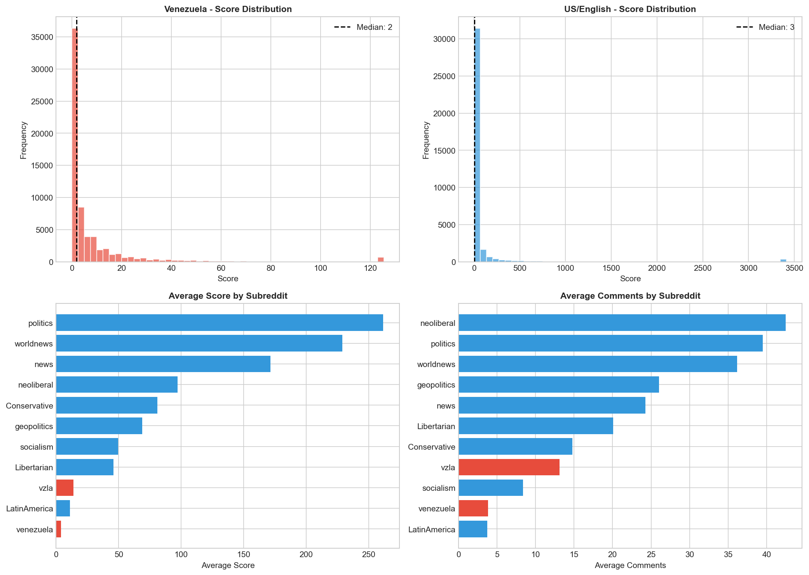
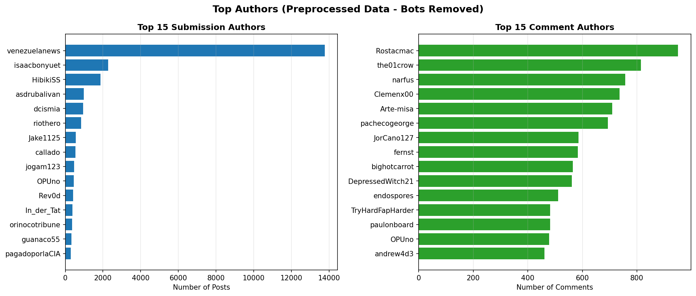

# Venezuela-US Reddit Discourse EDA Report

## 📊 Overview

| Metric | Value |
|--------|-------|
| **Data Period** | 2013-01-01 ~ 2026-01-29 |
| **Total Submissions** | 101,960 |
| **Total Comments** | 431,981 |
| **Total Data Points** | 533,941 |
| **Unique Submission Authors** | 26,363 |
| **Unique Comment Authors** | 129,740 |
| **Subreddits** | 11 |

---

## 🌎 Regional Distribution

### Subreddit Categories

| Region | Subreddits |
|--------|------------|
| 🇻🇪 **Venezuela** | r/vzla, r/venezuela |
| 🇺🇸 **US/English** | r/politics, r/news, r/worldnews, r/Conservative, r/Libertarian, r/neoliberal, r/socialism, r/geopolitics, r/LatinAmerica |

### Data by Region

| Region | Submissions | % | Comments | % |
|--------|-------------|---|----------|---|
| 🇻🇪 Venezuela | 65,857 | 64.6% | 220,291 | 51.0% |
| 🇺🇸 US/English | 36,103 | 35.4% | 211,690 | 49.0% |



---

## 📈 Timeline Analysis

### Full Timeline (2013-2026)



### Key Events

| Date | Event | Impact |
|------|-------|--------|
| 2014-02 | Venezuelan Protests | First major spike |
| 2017-08 | Trump Sanctions | Increased US attention |
| 2019-01 | Guaido Crisis | Highest peak (6,029 posts) |
| 2024-07 | 2024 Presidential Election | Recent surge |
| 2026-01 | Maduro Captured by US Forces | Latest peak |

### Top 10 Peak Months

| Month | Posts |
|-------|-------|
| 2019-02 | 6,029 |
| 2019-01 | 4,415 |
| 2026-01 | 4,414 |
| 2019-03 | 3,490 |
| 2018-08 | 1,880 |
| 2017-08 | 1,784 |
| 2019-05 | 1,746 |
| 2024-08 | 1,586 |
| 2018-12 | 1,524 |
| 2018-09 | 1,516 |

### Yearly Distribution



| Year | Submissions | Comments |
|------|-------------|----------|
| 2013 | 3,044 | 4,442 |
| 2014 | 4,373 | 7,929 |
| 2015 | 3,958 | 6,818 |
| 2016 | 4,745 | 13,540 |
| 2017 | 9,644 | 21,397 |
| 2018 | 14,104 | 27,910 |
| 2019 | 20,673 | 50,606 |
| 2020 | 6,359 | 18,168 |
| 2021 | 3,639 | 12,076 |
| 2022 | 4,019 | 21,127 |
| 2023 | 5,089 | 29,268 |
| 2024 | 9,603 | 66,692 |
| 2025 | 8,296 | 89,492 |
| 2026 | 4,414 | 62,516 |

---

## 📊 Subreddit Analysis



### Subreddit Statistics

| Subreddit | Posts | Avg Score | Median Score | Avg Comments |
|-----------|-------|-----------|--------------|--------------|
| 🇻🇪 r/vzla | 40,674 | 13.7 | 4.0 | 13.1 |
| 🇻🇪 r/venezuela | 25,183 | 3.8 | 1.0 | 3.8 |
| 🇺🇸 r/worldnews | 16,117 | 228.7 | 4.0 | 36.2 |
| 🇺🇸 r/news | 5,030 | 171.3 | 1.0 | 24.2 |
| 🇺🇸 r/politics | 4,896 | 261.6 | 1.0 | 39.5 |
| 🇺🇸 r/socialism | 4,281 | 49.7 | 6.0 | 8.4 |
| 🇺🇸 r/Conservative | 1,963 | 80.9 | 14.0 | 14.8 |
| 🇺🇸 r/Libertarian | 1,266 | 45.8 | 4.0 | 20.1 |
| 🇺🇸 r/neoliberal | 1,188 | 97.0 | 36.0 | 42.5 |
| 🇺🇸 r/geopolitics | 718 | 68.8 | 9.0 | 26.0 |
| 🇺🇸 r/LatinAmerica | 644 | 10.9 | 5.0 | 3.7 |

---

## 💬 Engagement Analysis



### Key Insights

- **US/English subreddits** have significantly higher average scores (more upvotes)
- **Venezuelan subreddits** have more total posts but lower individual engagement
- **r/worldnews** and **r/politics** drive the highest engagement per post

---

## 👥 Author Analysis



### Top 10 Submission Authors

| Author | Posts | Primary Subreddit |
|--------|-------|-------------------|
| venezuelanews | 13,767 | r/venezuela |
| [deleted] | 8,090 | r/vzla |
| isaacbonyuet | 2,270 | r/vzla |
| HibikiSS | 1,874 | r/vzla |
| AutoModerator | 1,519 | r/vzla |
| asdrubalivan | 987 | r/vzla |
| dcismia | 943 | r/worldnews |
| riothero | 846 | r/vzla |
| Jake1125 | 558 | r/venezuela |
| callado | 538 | r/vzla |

### Top 10 Comment Authors

| Author | Comments |
|--------|----------|
| [deleted] | 45,273 |
| AutoModerator | 4,058 |
| autotldr | 1,497 |
| empleadoEstatalBot | 1,250 |
| Rostacmac | 1,086 |
| the01crow | 882 |
| Clemenx00 | 824 |
| narfus | 803 |
| Arte-misa | 739 |
| pachecogeorge | 733 |

---

## 🏆 Top Posts by Score

| Rank | Subreddit | Title | Score | Comments | Date |
|------|-----------|-------|-------|----------|------|
| 1 | r/worldnews | Venezuela President Maduro breaks relations with US, gives A... | 93,588 | 9,602 | 2019-01-23 |
| 2 | r/news | Venezuela judge convicts 6 American oil execs, orders prison | 74,541 | 6,420 | 2020-11-27 |
| 3 | r/politics | Donald Trump Says He Will Flee to Venezuela if He Loses Elec... | 52,707 | 6,459 | 2024-08-13 |
| 4 | r/worldnews | 'We need help': Anger mounts as Venezuela's worst-ever black... | 46,843 | 7,455 | 2019-03-11 |
| 5 | r/politics | AOC Slams Operation To Capture Maduro: 'It's About Oil And R... | 44,556 | 1,368 | 2026-01-03 |
| 6 | r/worldnews | Erik Prince, a major Republican donor and founder of controv... | 43,195 | 1,627 | 2019-12-30 |
| 7 | r/worldnews | Venezuela opposition leader swears himself in as interim pre... | 42,328 | 4,344 | 2019-01-23 |
| 8 | r/worldnews | France Condemns US Operation To Capture Maduro | 42,148 | 3,610 | 2026-01-03 |
| 9 | r/worldnews | Venezuela, Uruguay, Japan warn citizens about traveling to t... | 41,224 | 3,376 | 2019-08-06 |
| 10 | r/news | Venezuela requests UN Security Council meet over ‘ongoing US... | 40,662 | 1,189 | 2025-12-18 |

---

## 📁 Data Files

### Merged Data Location
```
data-collection/data/
├── submissions/
│   └── *_20130101_20260129_monthly_filtered.json
└── comments/
    └── comments_*_20130101_20260129_monthly_filtered.json
```

### File Summary

| Type | Files | Total Records |
|------|-------|---------------|
| Submissions | 11 | 101,960 |
| Comments | 11 | 431,981 |

---

*Generated: 2026-01-29*
