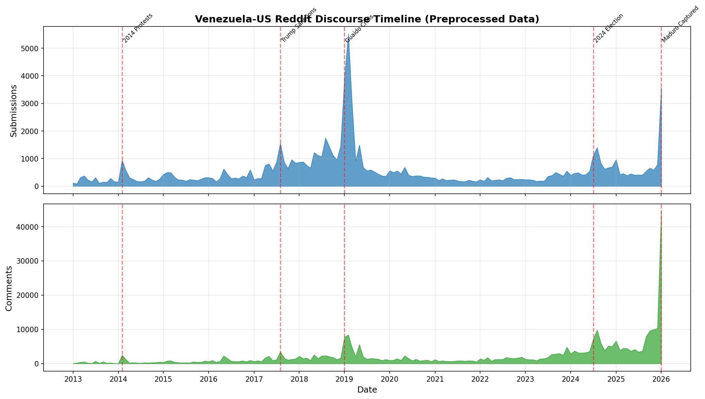

# Venezuela-US Reddit Discourse EDA Report (Preprocessed)

## Overview

| Metric | Value |
|--------|-------|
| **Data Period** | 2013-01-01 ~ 2026-01-28 |
| **Total Submissions** | 86,809 |
| **Total Comments** | 339,626 |
| **Total Data Points** | 426,435 |
| **Unique Submission Authors** | 23,497 |
| **Unique Comment Authors** | 119,021 |
| **Subreddits** | 11 |

### Preprocessing Applied
- Removed `[deleted]` and `[removed]` content
- Removed bot accounts (AutoModerator, autotldr, etc.)
- Removed comments with < 5 words
- Cleaned URLs, markdown formatting, edit markers

---

## Regional Distribution

### Subreddit Categories

| Region | Subreddits |
|--------|------------|
| Venezuela | r/vzla, r/venezuela |
| US/English | r/politics, r/news, r/worldnews, r/Conservative, r/Libertarian, r/neoliberal, r/socialism, r/geopolitics, r/LatinAmerica |

### Data by Region

| Region | Submissions | % | Comments | % |
|--------|-------------|---|----------|---|
| Venezuela | 56,321 | 64.9% | 184,373 | 54.3% |
| US/English | 30,488 | 35.1% | 155,253 | 45.7% |


---

## Timeline Analysis

### Full Timeline (2013-2026)



### Key Events

| Date | Event | Impact |
|------|-------|--------|
| 2014-02 | Venezuelan Protests | First major spike |
| 2017-08 | Trump Sanctions | Increased US attention |
| 2019-01 | Guaido Crisis | Highest peak |
| 2024-07 | 2024 Presidential Election | Recent surge |
| 2026-01 | Maduro Captured by US Forces | Latest peak |

### Top 10 Peak Months

| Month | Posts |
|-------|-------|
| 2019-02 | 5,518 |
| 2019-01 | 3,916 |
| 2026-01 | 3,571 |
| 2019-03 | 3,112 |
| 2018-08 | 1,746 |
| 2017-08 | 1,555 |
| 2019-05 | 1,494 |
| 2018-12 | 1,467 |
| 2018-09 | 1,420 |
| 2024-08 | 1,397 |

### Yearly Distribution


| Year | Submissions | Comments |
|------|-------------|----------|
| 2013 | 2,413 | 3,243 |
| 2014 | 3,736 | 6,243 |
| 2015 | 3,603 | 5,568 |
| 2016 | 4,193 | 10,651 |
| 2017 | 8,631 | 16,688 |
| 2018 | 13,262 | 21,475 |
| 2019 | 18,455 | 38,236 |
| 2020 | 5,209 | 13,582 |
| 2021 | 2,521 | 9,154 |
| 2022 | 2,918 | 17,084 |
| 2023 | 3,813 | 24,831 |
| 2024 | 8,029 | 56,487 |
| 2025 | 6,455 | 71,955 |
| 2026 | 3,571 | 44,429 |

---

## Subreddit Analysis


### Subreddit Statistics

| Subreddit | Posts | Avg Score | Median Score | Avg Comments |
|-----------|-------|-----------|--------------|--------------|
| 🇻🇪 r/vzla | 33,088 | 16.1 | 6.0 | 14.6 |
| 🇻🇪 r/venezuela | 23,233 | 4.0 | 1.0 | 4.0 |
| 🇺🇸 r/worldnews | 13,659 | 265.5 | 5.0 | 41.2 |
| 🇺🇸 r/news | 4,415 | 193.4 | 1.0 | 27.2 |
| 🇺🇸 r/politics | 3,873 | 323.5 | 7.0 | 48.2 |
| 🇺🇸 r/socialism | 3,573 | 55.8 | 9.0 | 9.2 |
| 🇺🇸 r/Conservative | 1,656 | 94.0 | 20.0 | 17.1 |
| 🇺🇸 r/Libertarian | 1,092 | 46.7 | 5.0 | 21.2 |
| 🇺🇸 r/neoliberal | 1,041 | 106.7 | 44.0 | 46.7 |
| 🇺🇸 r/geopolitics | 596 | 81.5 | 16.0 | 30.3 |
| 🇺🇸 r/LatinAmerica | 583 | 11.2 | 5.0 | 3.9 |

---

## Engagement Analysis


### Key Insights

- **US/English subreddits** have significantly higher average scores (more upvotes)
- **Venezuelan subreddits** have more total posts but lower individual engagement
- **r/worldnews** and **r/politics** drive the highest engagement per post

---

## Author Analysis


### Top 10 Submission Authors

| Author | Posts |
|--------|-------|
| venezuelanews | 13,766 |
| isaacbonyuet | 2,270 |
| HibikiSS | 1,871 |
| asdrubalivan | 987 |
| dcismia | 943 |
| riothero | 845 |
| Jake1125 | 557 |
| callado | 532 |
| jogam123 | 470 |
| OPUno | 454 |

### Top 10 Comment Authors

| Author | Comments |
|--------|----------|
| Rostacmac | 951 |
| the01crow | 815 |
| narfus | 757 |
| Clemenx00 | 736 |
| Arte-misa | 709 |
| pachecogeorge | 694 |
| JorCano127 | 586 |
| fernst | 583 |
| bighotcarrot | 565 |
| DepressedWitch21 | 561 |

---

## Top Posts by Score

| Rank | Subreddit | Title | Score | Comments | Date |
|------|-----------|-------|-------|----------|------|
| 1 | r/worldnews | Venezuela President Maduro breaks relations with U... | 93,588 | 9,602 | 2019-01-23 |
| 2 | r/news | Venezuela judge convicts 6 American oil execs, ord... | 74,541 | 6,420 | 2020-11-27 |
| 3 | r/politics | Donald Trump Says He Will Flee to Venezuela if He ... | 52,707 | 6,459 | 2024-08-13 |
| 4 | r/worldnews | 'We need help': Anger mounts as Venezuela's worst-... | 46,843 | 7,455 | 2019-03-11 |
| 5 | r/politics | AOC Slams Operation To Capture Maduro: 'It's About... | 44,556 | 1,368 | 2026-01-03 |
| 6 | r/worldnews | Erik Prince, a major Republican donor and founder ... | 43,195 | 1,627 | 2019-12-30 |
| 7 | r/worldnews | Venezuela opposition leader swears himself in as i... | 42,328 | 4,344 | 2019-01-23 |
| 8 | r/worldnews | France Condemns US Operation To Capture Maduro | 42,148 | 3,610 | 2026-01-03 |
| 9 | r/worldnews | Venezuela, Uruguay, Japan warn citizens about trav... | 41,224 | 3,376 | 2019-08-06 |
| 10 | r/news | Venezuela requests UN Security Council meet over ‘... | 40,662 | 1,189 | 2025-12-18 |

---

## Data Files

### Preprocessed Data Location
```
data-collection/data/preprocessed/
├── submissions_clean.parquet
└── comments_clean.parquet
```

---

*Generated: 2026-01-29*
